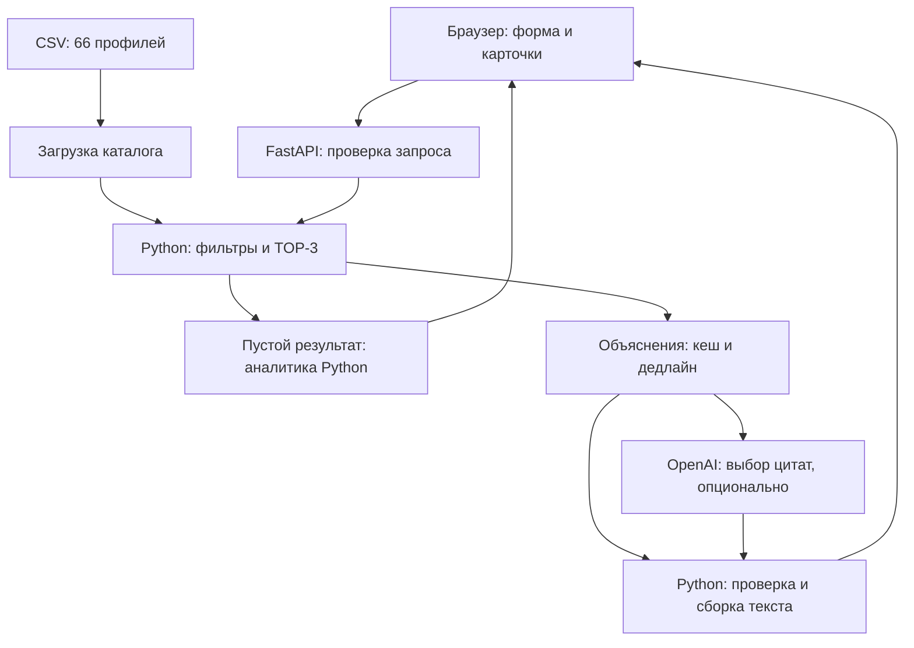

# NurSolution

**Умный подбор event-подрядчиков в Казахстане — до трёх карточек с объяснением каждого выбора.**

Решение хакатон-задачи **#79-lite** для заказчиков свадеб, тоев, корпоративов и других мероприятий.
Когда каталог уже выбран, NurSolution помогает сравнить подходящих подрядчиков: проверяет условия
заказа и показывает конкретные факты из профилей. Если никто не подходит, объясняет причины
и предлагает проверенные изменения условий.

**66 профилей в каталоге · FastAPI · OpenAI опционально · Запуск через Docker**

[Быстрый запуск](#быстрый-запуск) · [Проверка для жюри](#проверка-для-жюри) ·
[Архитектура](#архитектура) · [Документация](#документация)

## Что реализовано

- Строгая фильтрация по городу, категории, бюджету, занятости на дату и формату мероприятия;
  дополнительно — по языку и длительности.
- До трёх карточек с именем, категорией, городом, ценой «от» и объяснением на основе данных профиля.
- Детерминированный состав и порядок карточек при неизменных запросе и каталоге.
- Различимые состояния: подрядчики подобраны, категории в городе нет, условия не прошёл никто.
- Счётчики причин отказа и подсказки при пустом подборе: изменить одно условие и проверить результат.
- Работа без ключа OpenAI; при ошибке или таймауте модели объяснения формирует Python.
- Кеш проверенных AI-ответов, объединение одинаковых одновременных запросов и ограничение числа LLM-вызовов.
- Адаптивный веб-интерфейс на русском, HTTP API, Swagger UI и автоматические тесты.

## Как работает решение

1. Заказчик указывает **город, дату, формат мероприятия, категорию и бюджет в тенге**.
   Язык и длительность в часах необязательны.
2. Python проверяет профили из CSV. Занятые на указанную дату и не соответствующие условиям
   подрядчики исключаются. Каталог не расширяется.
3. Подходящие профили сортируются по близости цены к бюджету, затем по совпадению языка
   и строковому `id`. Выбираются первые три. При строгом фильтре по языку все оставшиеся ему соответствуют.
4. Если AI включён, модель получает только выбранные профили и выбирает дословные цитаты
   из описаний. Python проверяет цитаты и собирает итоговые объяснения с ценой и условиями.
5. Интерфейс показывает карточки либо аналитику пустого результата. Подсказка применяет одно
   изменение к форме и запускает новый поиск. При пустой выдаче обращения к LLM нет.

## Быстрый запуск

Нужны Git и Docker Engine / Docker Desktop с Linux-контейнерами и Docker Compose.
Python и Node.js на хосте для этого способа не требуются. Первая сборка скачивает образ и зависимости.

### 1. Получите проект

```bash
git clone https://github.com/BAITC-Hacks/hack-dbe07283-nursolution.git
cd hack-dbe07283-nursolution
```

Если репозиторий уже открыт локально, выполняйте следующие команды из его корня.

### 2. Запустите демо без вызовов OpenAI

Для демо создавать `.env` не нужно. Явно отключите LLM, чтобы существующие настройки
окружения не включили платные API-вызовы.

**Windows / PowerShell:**

```powershell
$env:MATCHER_USE_LLM = "false"
docker compose up --build -d --wait
```

**Linux / macOS / Bash:**

```bash
MATCHER_USE_LLM=false docker compose up --build -d --wait
```

### 3. Откройте приложение

| Адрес | Что доступно |
| --- | --- |
| [localhost:8080](http://localhost:8080) | Форма подбора и карточки |
| [localhost:8080/docs](http://localhost:8080/docs) | Swagger UI: запросы прямо из браузера |
| [localhost:8080/health](http://localhost:8080/health) | Готовность API и число загруженных профилей |

Адреса приведены для стандартного порта `8080`. Контейнер публикуется только на локальном интерфейсе.

```bash
docker compose ps
docker compose logs --tail=100 web
docker compose down
```

После изменения кода или CSV повторите запуск с `--build`.
Подключение OpenAI и все переменные окружения описаны в [настройках](docs/configuration.md).

## Проверка для жюри

Запустите демо по инструкции выше. Для всех сценариев используйте **Алматы**, дату
**2026-09-26**, язык **«Любой»** и пустую длительность. Это фиксированная дата демонстрации,
а не рекомендация выбрать ближайший день.

| Сценарий | Категория | Формат | Бюджет | Ожидаемый результат на текущем CSV |
| --- | --- | --- | --- | --- |
| Основной подбор | Ведущий | корпоратив | 1 000 000 ₸ | `matched`, 3 карточки |
| Редкая категория | Флорист | свадьба | 2 000 000 ₸ | `matched`, 1 карточка и причина, почему меньше трёх |
| Никто не проходит условия | Ведущий | корпоратив | 1 ₸ | `no_matches`, причины отказов и проверенная подсказка по бюджету |
| Категории нет в городе | Несуществующая категория | корпоратив | 1 000 000 ₸ | `no_category_in_city`, текстовое объяснение |

Первые три сценария можно повторить в форме. Четвёртый выполняется через Swagger UI:
список категорий в форме состоит только из значений каталога.

Для проверки порядка повторите основной запрос. Ожидаемые `id` карточек:
**`HK-44733` → `HK-29829` → `HK-88430`**.

Пример тела `POST /match` для Swagger UI:

```json
{
  "city": "Алматы",
  "date": "2026-09-26",
  "event_type": "корпоратив",
  "category": "Ведущий",
  "budget": 1000000
}
```

Автоматическая проверка в отдельном тестовом контейнере:

```bash
docker compose run --build --rm tests
```

В проекте 54 теста: фильтры, три бизнес-исхода, стабильный порядок, подсказки, валидация API,
проверка ответов модели, кеш, дедлайн и конкурентные запросы. Тесты используют подставные
LLM-клиенты и не требуют ключа OpenAI; они не подтверждают качество живой модели или работу под нагрузкой.

## Технологии

| Компонент | Реализация |
| --- | --- |
| Бэкенд | Python 3.10+, FastAPI, Uvicorn |
| Контракты и валидация API | Pydantic v2 |
| Каталог | CSV, стандартный модуль `csv`, модели `dataclasses` |
| AI | OpenAI Python SDK, Chat Completions API, `gpt-4o-mini`, `temperature=0.0` |
| Настройки | Переменные окружения, `python-dotenv` |
| Фронтенд | HTML, CSS, JavaScript без сборщика и UI-фреймворка |
| Тесты | `unittest`, FastAPI TestClient, HTTPX |
| Запуск | Docker, Docker Compose; Python 3.12 в контейнере |

Зависимости указаны в [requirements.txt](requirements.txt) и [requirements-dev.txt](requirements-dev.txt).

## Архитектура

Проект организован как **модульный монолит**: фронтенд, API и каталог поставляются одним
приложением. База данных, Redis и отдельные микросервисы для текущей реализации не нужны.



```text
app/
├── api/             # HTTP-маршруты, схемы, ошибки и отсчёт дедлайна
├── domain/          # Модель подрядчика и проверка значений
├── repositories/    # Чтение и валидация CSV
├── services/        # Подбор, подсказки, объяснения, кеш и OpenAI
├── config.py        # Пути и настройки процесса
└── cli.py           # Три демонстрационных сценария
frontend/            # HTML, CSS, JavaScript и favicon
data/                # Исходный каталог
tests/               # Автоматические тесты
docs/                # API, архитектура и настройки
api.py               # Совместимая точка входа uvicorn api:app
smart_matcher.py     # Совместимый импорт EventMatcher и запуск демо
schemas.py           # Совместимые импорты HTTP-схем
Dockerfile           # Образы приложения и тестов
compose.yaml         # Локальный запуск контейнеров
.env.example         # Образец настроек без рабочего ключа
```

Корневые Python-файлы сохраняют прежние точки входа. Основная реализация находится в `app/`.
Подробнее о границах модулей, фильтрах и AI — в [архитектуре](docs/architecture.md).

## Локальная разработка

Нужен Python 3.10 или новее. Команды выполняются из корня проекта.

**Windows / PowerShell:**

```powershell
python -m venv .venv
.\.venv\Scripts\python.exe -m pip install -r requirements-dev.txt
$env:MATCHER_USE_LLM = "false"
.\.venv\Scripts\python.exe -m uvicorn app.api.application:app --reload --port 8000
```

**Linux / macOS / Bash:**

```bash
python3 -m venv .venv
.venv/bin/python -m pip install -r requirements-dev.txt
MATCHER_USE_LLM=false .venv/bin/python -m uvicorn app.api.application:app --reload --port 8000
```

Интерфейс доступен на [localhost:8000](http://localhost:8000), Swagger — на
[localhost:8000/docs](http://localhost:8000/docs). Сборка фронтенда не требуется.

В другом терминале запустите тесты и консольное демо:

```powershell
.\.venv\Scripts\python.exe -m unittest -v
.\.venv\Scripts\python.exe smart_matcher.py --offline
```

На Linux / macOS замените `.\.venv\Scripts\python.exe` на `.venv/bin/python`.
CLI демонстрирует плотную категорию, редкую категорию и пустой подбор с аналитикой.

## Данные и интеграции

Источник — предоставленный для хакатона [анонимизированный CSV](data/hackathon%20dataset%20anonymized%20.csv)
с **66 профилями** и вымышленными именами. Он содержит `id`, `anon_name`, `categories`, `city`,
`price_from_kzt`, `event_formats`, `languages`, `max_hours`, `busy_dates`, `description`.
Списковые значения разделены символом `|`. Каталог загружается при старте процесса.

Единственная внешняя AI-интеграция — OpenAI. При включённой LLM ей передаются параметры
заказа, до трёх выбранных профилей и варианты цитат. Ключ хранится на сервере, `.env`
исключён из Git и Docker-образа. Без OpenAI подбор и объяснения на Python доступны полностью.

## Ограничения

- Цена «от» — нижняя граница, а не окончательная смета. Свободная дата в CSV не подтверждает бронь.
- Нет бронирования, оплаты, авторизации, редактора профилей и синхронизации с календарями подрядчиков.
- Каталог статический: после изменения CSV нужен перезапуск, для Docker — пересборка образа.
- Ранжирование учитывает заданные условия и цену; семантического поиска по всему каталогу нет.
  Цитаты проверяются по CSV, достоверность заявлений подрядчика независимо не проверяется.
- Состав и порядок карточек стабильны; выбор цитаты живой моделью может меняться после истечения кеша.
- По умолчанию бюджет обработки — 8 секунд, SDK-таймаут — до 7 секунд. При истечении ожидания
  используются объяснения Python. Это не гарантия сетевого времени ответа или SLA под нагрузкой.
- Кеш и лимит LLM-вызовов локальны для процесса. Общего распределённого кеша и системы метрик нет.
- Подсказки проверяют изменение одного условия; поиск новой даты ограничен следующими 14 днями.

## Развёрнутая версия

Публичный адрес развёрнутой версии в репозитории не указан. Проверить решение можно
локально через Docker по инструкции выше; `localhost` не является публичным демо.

## Документация

| Документ | Содержание |
| --- | --- |
| [API](docs/api.md) | Маршруты, запросы, поля ответа, статусы и ошибки |
| [Архитектура](docs/architecture.md) | Четыре этапа, детерминизм, проверка цитат, дедлайн и кеш |
| [Настройки и запуск](docs/configuration.md) | `.env`, подключение OpenAI, Docker и устранение проблем запуска |
