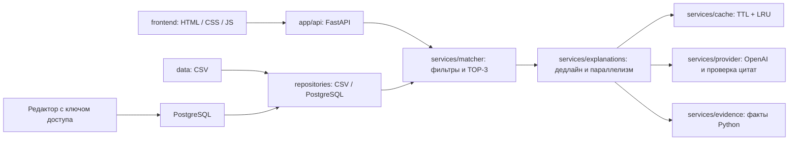

# Архитектура NurSolution

[README](../README.md) · [API](api.md) · [Настройки](configuration.md)

Модульный монолит: одно приложение для развёртывания, явные границы модулей.
FastAPI обслуживает API и статический фронтенд, CSV хранится вместе с приложением; альтернативный источник — PostgreSQL.
OpenAI — опциональная внешняя интеграция для выбора цитат. База подключается опционально; брокера сообщений нет.

## Компоненты

| Компонент | Ответственность |
| --- | --- |
| [`frontend/`](../frontend/) | Главная, форма подбора, карточки, подсказки и редактор |
| [`app/api/`](../app/api/) | HTTP-контракт, валидация тела, ошибки и начало отсчёта времени |
| [`app/domain/`](../app/domain/) | Модель подрядчика и общие правила проверки значений |
| [`app/repositories/catalog.py`](../app/repositories/catalog.py) | Чтение CSV и проверка целостности каталога |
| [`app/services/cards.py`](../app/services/cards.py) | Сборка карточки и структурированных фактов после фильтрации |
| [`app/services/matcher.py`](../app/services/matcher.py) | Строгие фильтры, аналитика, проверка подсказок и TOP-3 |
| [`app/services/explanations.py`](../app/services/explanations.py) | Резервные объяснения, дедлайн, кеш и ограничение параллелизма |
| [`app/services/provider.py`](../app/services/provider.py) | Вызов OpenAI и валидация цитат |
| [`app/services/evidence.py`](../app/services/evidence.py) | Выделение фактов и сборка итогового текста |
| [`app/services/cache.py`](../app/services/cache.py) | Кеш с TTL и вытеснением по LRU |
| [`app/config.py`](../app/config.py) | Стандартные пути и настройки окружения |

Модели предметной области не зависят от FastAPI. HTTP-слой вызывает сервис подбора,
сервис использует загрузчик каталога и сервис объяснений. Корневые `api.py`,
`schemas.py`, `smart_matcher.py` обеспечивают совместимость импортов и команд запуска;
второй реализации бизнес-логики в них нет.

## Четыре этапа

1. CSV-адаптер читает CSV один раз на процесс; PostgreSQL-адаптер получает свежий снимок
   на каждый подбор. Асинхронный API выполняет подготовку через `asyncio.to_thread`,
   чтобы синхронный запрос базы не блокировал цикл событий. `matcher.py` применяет строгие фильтры:
   город → категория → бюджет → дата → формат → язык → длительность. Счётчик
   учитывает первую причину отказа каждого профиля. Неизвестная длительность при
   запросе часов исключается отдельно. Сумма отказов и `eligible_count` равна
   `total_profiles`.
2. Если кандидатов нет, результат и советы возвращаются без SDK-клиента и LLM.
   Подсказки меняют ровно одно условие, сохраняя город и категорию. Бюджет —
   минимальный достаточный, дата — ближайшая последующая в пределах 14 дней,
   формат/язык — с максимальным числом кандидатов, длительность — наибольшая
   подходящая. Все советы проверяются теми же фильтрами.
3. Кандидаты сортируются по разнице с бюджетом, совпадению языка и строковому `id`.
   При строгом фильтре язык одинаково подходит всем. Выбираются максимум три.
4. `explanations.py` заранее строит объяснения Python и пробует получить проверенные
   цитаты из кеша или одного пакетного вызова `gpt-4o-mini` с `temperature=0.0`.
   `provider.py` проверяет ответ, `evidence.py` собирает текст. Модель не влияет
   на состав и порядок карточек. Неизвестные/повторные id отклоняют ответ целиком;
   пропущенные или неподтверждённые цитаты заменяются только у соответствующего профиля.

## От данных к интерфейсу

Главная страница `/` показывает описание решения и переход к подбору, без формы
и запросов к API каталога. Кнопка «Подобрать подрядчиков» открывает `/selection`.
Эта страница загружает `/catalog` и показывает форму заказа; подбор и OpenAI при
этом не вызываются. Пользователь отправляет форму кнопкой «Подобрать людей»;
результаты показываются справа от формы, на мобильном экране — ниже. Изменение поля
само по себе не отправляет запрос. Применение подсказки выполняет новый подбор
с указанным изменением условий.

Сборка карточки находится в `app/services/cards.py`, отдельно от фильтров и ранжирования.
`match_facts` содержит числа и проверенные условия; `evidence` — исходную цитату;
`explanation` сохраняет краткий текст для прямых интеграций. Модель не формирует
`match_facts` и не определяет оформление карточки.

Фронтенд разделён на ES-модули без дополнительной сборки:

| Модуль | Ответственность |
| --- | --- |
| [`frontend/index.html`](../frontend/index.html), [`frontend/home.js`](../frontend/home.js) | Главная страница и переход к форме |
| [`frontend/selection.html`](../frontend/selection.html) | Страница формы заказа и результатов |
| [`frontend/about.js`](../frontend/about.js) | Общее модальное окно «Как это работает» на главной и странице подбора |
| [`frontend/app.js`](../frontend/app.js) | Форма, запросы, отмена устаревших ответов и состояния результатов |
| [`frontend/cards.js`](../frontend/cards.js) | Карточки, сравнение цены с лимитом и раскрываемые условия |
| [`frontend/ui.js`](../frontend/ui.js) | Создание текстовых DOM-узлов и форматирование чисел и дат |
| [`frontend/styles.css`](../frontend/styles.css) | Цвета, типографика, состояния и адаптивные правила |

Цитата, цена и совпадения отображаются раздельно. Интерфейс не разбирает текст модели
и не делает вывод о подтверждённой доступности. Все значения профилей вставляются
как текст, а не HTML. Резервный текст остаётся доступным, если в профиле нет допустимой цитаты.

## Детерминизм и границы AI

Фильтры и порядок карточек определяет Python. При одинаковых запросе и каталоге
результат не зависит от порядка строк CSV и ответа модели: при равных условиях
последний ключ сортировки — строковый `id`. Цена сортируется от ближайшей к бюджету
в пределах допустимого, а не от самой низкой.

LLM получает параметры заказа, выбранные профили и допустимые цитаты одним пакетным
запросом. Она не может добавить подрядчика, изменить цену или переставить карточки.
Вместо свободного пересказа используется выбор проверяемой дословной цитаты.
`temperature=0.0` не является гарантией одинакового текста живой модели после
истечения кеша; гарантия стабильности относится к составу и порядку карточек.

## Дедлайн

По умолчанию на обработку запроса выделено 8 секунд. ASGI middleware отмечает начало
до чтения тела и валидации; подготовка подбора расходует тот же бюджет. SDK получает
таймаут не больше оставшегося бюджета и не больше 7 секунд, без повторов. Независимо
от поведения SDK, ожидание Future прекращается по оставшемуся времени и ответ
содержит уже подготовленные карточки Python. Синхронный `match()` начинает отсчёт
при входе в метод; API использует асинхронный `amatch()`.

Это ограничение ожидания внутри приложения, а не гарантия времени сети до браузера:
передача тела, планирование ОС, локальные вычисления и отправка ответа не прерываются
принудительно. На текущем каталоге локальные операции короткие; целевой ответ до
10 секунд проверяется отдельным тестированием при реальной нагрузке.

Синхронный SDK работает в отдельных daemon-потоках. По умолчанию допускаются четыре
незавершённых вызова на процесс; очереди нет. Когда лимит исчерпан, новые уникальные
запросы сразу получают факты Python. Одинаковые запросы разделяют один Future, но
каждый ждёт до собственного дедлайна. Отмена одного HTTP-запроса не отменяет работу
для остальных.

Дедлайн не может принудительно завершить синхронный сетевой вызов: слот освобождается
только после его завершения. Запоздалый ответ не кешируется и не заменяет уже
отправленные карточки. При закрытии сервиса новые вызовы запрещаются; принадлежащий
сервису SDK-клиент закрывает последний завершившийся worker. Внедрённым клиентом
управляет вызывающий код.

## Кеш

- TTL: 600 секунд с момента записи, без продления при чтении.
- Максимум 256 пакетных результатов на процесс, вытеснение по LRU.
- Ключ: проверенные параметры запроса, полные выбранные профили, модель,
  temperature, системный промпт и версия протокола `PROMPT_VERSION`.
- Изменение цены, занятости, описания, набора кандидатов или запроса меняет ключ.
- Только полностью проверенные успешные ответы. Ошибки, частичные ответы,
  локальные fallback и результаты после дедлайна не сохраняются.
- Значения копируются при чтении/записи: потребитель не может испортить общий кеш.
- `EXPLANATION_CACHE_TTL_SECONDS=0` или `EXPLANATION_CACHE_MAX_ENTRIES=0` отключает
  хранение, но объединение одновременных одинаковых запросов сохраняется.

Кеш и ограничения принадлежат процессу. При нескольких Uvicorn workers каждый имеет
свой кеш и четыре слота. После перезапуска кеш пуст. Чтобы перечитать изменённый CSV,
нужно перезапустить процесс, в Docker — пересобрать образ. В PostgreSQL новые запросы
видят сохранённые изменения; содержимое профилей в ключе кеша исключает повторное
использование прежнего объяснения для изменённых данных.
При изменении протокола выбора цитат необходимо увеличить `PROMPT_VERSION`.

## Контракт объяснений

`explanation_source="openai"` означает, что цитату выбрала модель (в том числе из
кеша); окончательный текст всегда проверен и собран Python. `python` означает
локальный выбор фактов. Поле `evidence` содержит исходную цитату или `null`.
Проверяется соответствие выбранному каталогу, а не независимая достоверность заявлений подрядчика.
Цена «от» не является окончательной сметой, отсутствие busy_date не подтверждает бронь.

## Развёртывание

[`Dockerfile`](../Dockerfile) содержит отдельные цели `runtime` и `test`.
В runtime входят код, фронтенд и CSV, а тесты устанавливаются и запускаются в отдельном
образе. [`compose.yaml`](../compose.yaml) запускает сервис `web`; сервис `tests`
используется по явной команде. Ограничения контейнера и настройки окружения описаны
в [инструкции запуска](configuration.md#docker).

При локальном запуске пути к стандартному CSV и фронтенду вычисляются от расположения
кода, независимо от рабочей директории. CSV читается один раз при старте API;
его ошибка останавливает запуск. API, CLI и прямой Python-вызов используют один `EventMatcher`.

## Хранение, редактор и эксплуатация

`repositories/source.py` задаёт контракт `Catalog.load()`. CSV возвращает неизменяемый
снимок, PostgreSQL — актуальный снимок таблицы. `EventMatcher` не зависит от SQL.
Первичная схема и CSV-импорт создаются транзакционно один раз; используется версия
схемы и блокировка для одновременного старта workers. Подробности — в [каталоге](catalog.md).

Редактор защищён отдельным Bearer-ключом. Он валидирует поля через Pydantic,
сохраняет профиль транзакционно и проверяет `revision` для защиты от потерянных
обновлений. Открытые до сохранения запросы завершаются со своим снимком данных.

`observability.py` хранит потокобезопасные агрегаты без пользовательских параметров;
`/metrics` отдаёт JSON, middleware измеряет запросы и пишет идентификаторы в журнал.
[Локальные тесты](testing.md) проверяют API, оба хранилища и браузерные сценарии;
основной набор также запускается в Docker.

## Возможное развитие

- Отдельные аккаунты редакторов, права доступа, аудит изменений и резервное копирование.
- Явные миграции при изменении схемы PostgreSQL; сейчас поддерживается первоначальная версия 1.
- Экспорт метрик, хранение истории и нагрузочные испытания с настоящим OpenAI.
- SQL-фильтрация и индексы при существенном росте каталога.

Отдельный сервис объяснений имеет смысл при независимом масштабировании;
Redis — при общем кеше нескольких процессов. Текущая версия их не использует.
